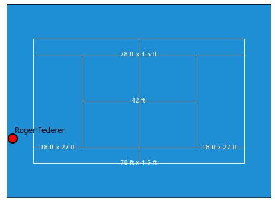

# Introduction

I'm working to build an OpenSource Tennis betting algorithim that can ideally predict the outcomes of singles matches in ATP, WTA, and the ATP Challenger Series. After doing some initial research it does not look like such an algorithim currently exists ready to use out of the box so some work is needed. 

I did find a [Tennis-Betting-ML Model written by GitHub user BrandonPolistirolo](https://github.com/BrandoPolistirolo/Tennis-Betting-ML) that should be able to serve as the basis for a production model. 

However, the model itself is predicated off of a large [Kaggle Tennis Dataset](https://www.kaggle.com/ehallmar/a-large-tennis-dataset-for-atp-and-itf-betting?select=all_matches.csv) that is not being updated. As an alternative there is an [OpenSource Tennis_ATP Dataset by JeffSackmann](https://github.com/JeffSackmann/tennis_atp) that could prove useful.

# Tennis Betting Algorithm
This repository contains an open-source tennis betting algorithm that aims to predict the outcomes of singles matches in ATP, WTA, and ATP Challenger Series. The algorithm uses logistic regression, a classification algorithm known for its speed of training, resistance to overfitting, and ability to directly return a match-winning probability.

## Model
The logistic regression algorithm uses the logistic function to map real-valued inputs between -∞ and +∞ to values between 0 and 1, allowing for its output to be interpreted as a probability. To make a prediction using the model, the algorithm projects a point in the n-dimensional feature space to a real number and then maps it to a value in the acceptable range of probability using the logistic function.

The training of the model consists of optimizing the parameters β by minimizing the logistic loss, which gives a measure of the error of the model in predicting the outcomes of matches used for training.

## Stochastic Gradient Descent
The purpose of Stochastic Gradient Descent (SGD) is to iteratively find a minimum for the log loss function while adding L2 regularization to prevent overfitting. The SGD algorithm, combined with a log loss function, provides a logistical prediction model as an output. For every iteration, the gradient of the loss function is computed on a sample of the data, and then the weights are updated accordingly. Convergence is achieved when a tolerance constant is satisfied.

# Simulate Match
You can simulate the outcome of a tennis match by using the `simulate_tennis_match.py` file. Below is an example. In the future updates will be made to better incoprorate a plaery's historical performance and specific strengths, along with handling for weather.

## Call Function
```
from simulate_tennis_match import Player, Match, simulate_match
import random

# Create a Match instance
match = Match(player1=None, player2=None, best_of=3, court_surface='hard')

# Create two Player instances
player1 = Player(name='Roger Federer', skill_level=0.8, match=match)
player2 = Player(name='Rafael Nadal', skill_level=0.9, match=match)

# Set the players for the match
match.player1 = player1
match.player2 = player2

# Set the match for the players
player1.match = match
player2.match = match

# Call simulate match function
random.seed(42) # setting this random seed will ensure repeated runs will always produce same results for testing. Can be changed or removed.
simulate_match(player1, player2, best_of=3, court_surface='hard')

# Print plot
player1.plot_court_position(court_position=(-.1, 0.2))
```
## Output
```
Roger Federer is serving first in the match
Starting Game 1 simulation:
	Current game score: Roger Federer 0 - 0 Rafael Nadal
		Roger Federer faults!
		Roger Federer's second serve
		Rafael Nadal wins the point

	Current game score: Roger Federer 0 - 15 Rafael Nadal
		Roger Federer's first serve
		Roger Federer wins the point

	Current game score: Roger Federer 15 - 15 Rafael Nadal
		Roger Federer's first serve
		Roger Federer wins the point

	...

	Current game score: Roger Federer 15 - 40 Rafael Nadal
			Roger Federer's first serve
			Rafael Nadal wins the point


	Player Rafael Nadal wins game 15!
	Player Rafael Nadal wins set 2 (0-2)
	Player Rafael Nadal wins the match!
```



# Next Steps

1. Thoughts for `kaggle_tennis_data_preprocessing.py`
	
	Note: Commit on 2023-05-26 made significant updates to this file which should improve overall performance. 

	Details: More details in `changelog.md` file but further work is needed.This code due to it's long nature has moderate run times, a few minutes. While this is acceptable for the initialization of the data it could be more efficient by performing certain functions only on the incremental rows it gets in the future. 

2. Thoughts for new step before dropping duplicate matches. 

	Note: Commit on 2023-05-26 made significant progress towards this end goal. 
	
	Details: 
		- Getting Prior Data
			- Currently experiencing long run times trying to calculate players ELOs as it has to search for data across both `player_id` and `opponent_id` in the `final_dataset.csv` file. By calculating ELO prior to dropping dupplicate matches we won't have to search for data across both `player_id and `
			- Use `shift` function within Pandas to get player's stats coming into a match as opposed to after the match. Rename columns as `running_total_matches_grass_1_prior` 
			- It is probably worth grabbin this data for `_last_3` and `_last_7` to evaluate recent form.
		- ELO Calculation
			- I'm getting very wild swings in ELO which is leading me to believe that the ELO function needs to be refined.
			- I've drafted up a rough `elo_pipeline.py` file that will serve to optimize the constants within the ELO calculation to best predict match winners.


3. Tennis match simulation

	Note: Commit 65a8396 on May 1st introduced `simulate_tennis_match.py`

	Details: This is the first step in simulating entire matches. Further improvements can be made overtime to improve it's accuracy.

    - Update function to simulate X number of matches. More samples of same match will give us probalistic understanding regarding outcomes of a match.
    - Change the execution to only print outcome of each point when in debug mode to reduce the output noise.
    - Update player class object to allow for specific player attributes beyond just "player skill". So first serve rate, serve speed, etc.
    - Update function to store simulated match results for statical analysis later.
    - Update function to control for weather and indoors vs outdoors.

4. Additional thoughts:

	- As I'm nearing actually training the model we'll have to hot_encode dimensions such as country (e.g. US, UK, CA. etc.) into values (e.g. 0, 1, 2, etc.). While this is easy to do, we should also consider ensuring that a player's nationality and the country of the match are encoded the same. There may be a "home court advantage" that we can train the model on in via this approach.

