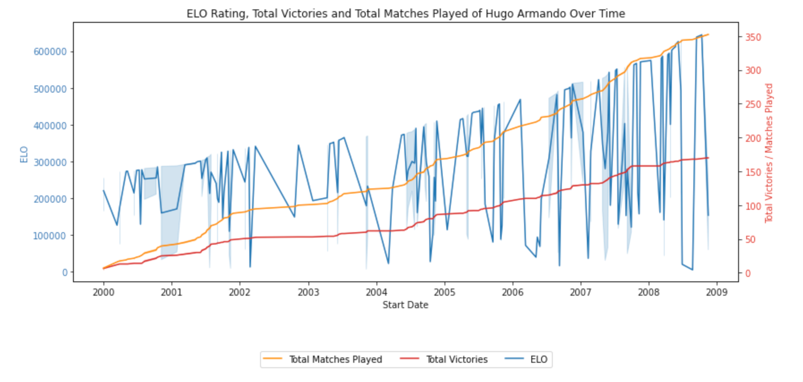

# Introduction

I'm working to build an OpenSource Tennis betting algorithim that can ideally predict the outcomes of singles matches in ATP, WTA, and the ATP Challenger Series. After doing some initial research it does not look like such an algorithim currently exists ready to use out of the box so some work is needed. 

I did find a [Tennis-Betting-ML Model written by GitHub user BrandonPolistirolo](https://github.com/BrandoPolistirolo/Tennis-Betting-ML) that should be able to serve as the basis for a production model. 

However, the model itself is predicated off of a large [Kaggle Tennis Dataset](https://www.kaggle.com/ehallmar/a-large-tennis-dataset-for-atp-and-itf-betting?select=all_matches.csv) that is not being updated. As an alternative there is an [OpenSource Tennis_ATP Dataset by JeffSackmann](https://github.com/JeffSackmann/tennis_atp) that could prove useful.

# Tennis Betting Algorithm
This repository contains an open-source tennis betting algorithm that aims to predict the outcomes of singles matches in ATP, WTA, and ATP Challenger Series. The algorithm uses logistic regression, a classification algorithm known for its speed of training, resistance to overfitting, and ability to directly return a match-winning probability.

## Model
The logistic regression algorithm uses the logistic function to map real-valued inputs between -∞ and +∞ to values between 0 and 1, allowing for its output to be interpreted as a probability. To make a prediction using the model, the algorithm projects a point in the n-dimensional feature space to a real number and then maps it to a value in the acceptable range of probability using the logistic function.

The training of the model consists of optimizing the parameters β by minimizing the logistic loss, which gives a measure of the error of the model in predicting the outcomes of matches used for training.

## Stochastic Gradient Descent
The purpose of Stochastic Gradient Descent (SGD) is to iteratively find a minimum for the log loss function while adding L2 regularization to prevent overfitting. The SGD algorithm, combined with a log loss function, provides a logistical prediction model as an output. For every iteration, the gradient of the loss function is computed on a sample of the data, and then the weights are updated accordingly. Convergence is achieved when a tolerance constant is satisfied.

# Next Steps

1. I created a function in the `helper_functions.py` file to read and save data to the data folder to keep the main folder a bit more tidy. This should look to be implemented across even already completed rewritten scripts. I've gone ahead and moved the data files into these folders. Code will need to be updated before it will work. 

2. Thoughts for `kaggle_tennis_data_preprocessing.py`
	
	- Court surface should have `carpet` updated to grass
	- This code should still be updated to calculate things such as `running_total_matches` and `running_total_victories` for each unique court surface
	- This code due to it's long nature has moderate run times, a few minutes. While this is acceptable for the initialization of the data it could be more efficient by performing certain functions only on the incremental rows it gets in the future. 
	   - Had a hard enough time getting the running_total_matches to work properly that I'm not sure I want to go back to this portion of the code for a while, but this would be the most difficult part to get working with the incremental update.

2. Thoughts for new step before dropping duplicate matches. 
	
	- I'm hitting long run times when trying to calculate players ELOs due to having to search for their data across both `player_id` and `opponent_id` in the `final_df.csv` file. A couple of thoughts:
	- Before dropping duplicate matches it is probably better to calculate the ELO then as every player will have every match they've played where their player id is in the `player_id` column as opposed to either the `player_id` or `opponent_id` column. 
	- ELO calculation needs to be added for each `court_surface` once `kaggle_tennis_data_preprocessing.py` is updated
	- Additionally, you can then easily use a shift function to retrieve players' stats coming into the match. It is probably worth grabbin this data for `last_3` and `last_7` matches in total and on each surface to evaluate recent form. 
	   - Eventually when doing Principal Component Analysis (PCA) it is likely that `last_3` and `last_7` will interfere with one another or overfit the model to recent performance but worth grabbing now to evaluate later

3. Thoughs on the ELO calculation.
	- I'm getting very wild swings in ELO which is leading me to believe that the ELO function needs to be refined. It is good that we see movements in this score, but my gut tells me that after a loss a player's ELO will tank which will lead them to being underrated in their next match.

	

	   - It is probably worth seeing if a recursive function can be implemented here to adjust the ELO algorithim with the success outcome being accuracy in predicting future matches. I could imagine this type of recursive loop to be ver computationaly intense. A random grid search of values may be a reasonable solution which will also help in preventing over fitting. 

4. Continue to explore the rest of the repository thoroughly to understand how the different files work together. 
